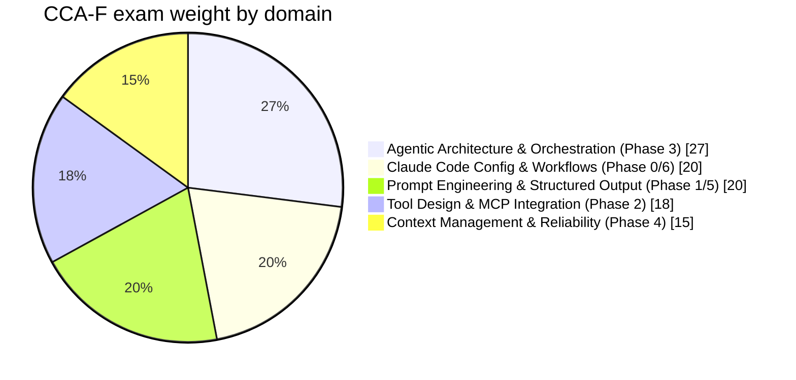
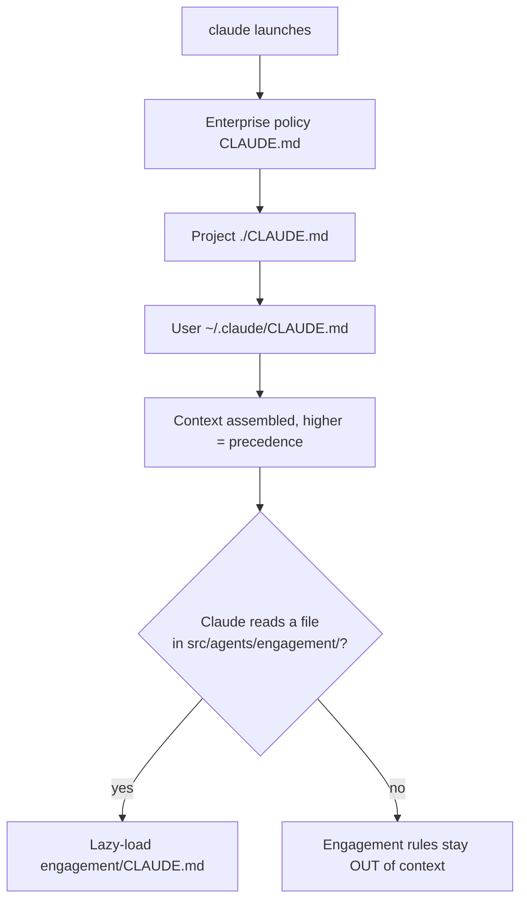
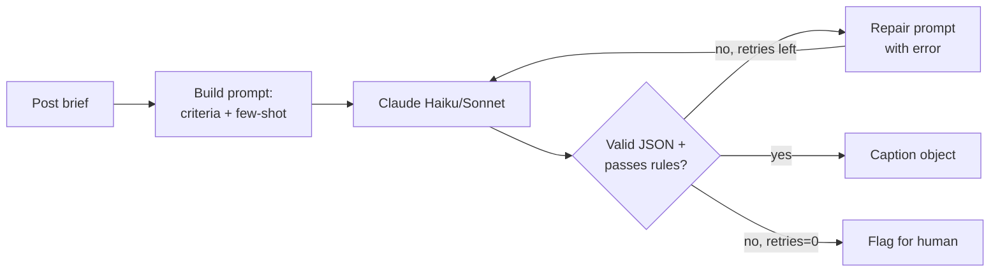
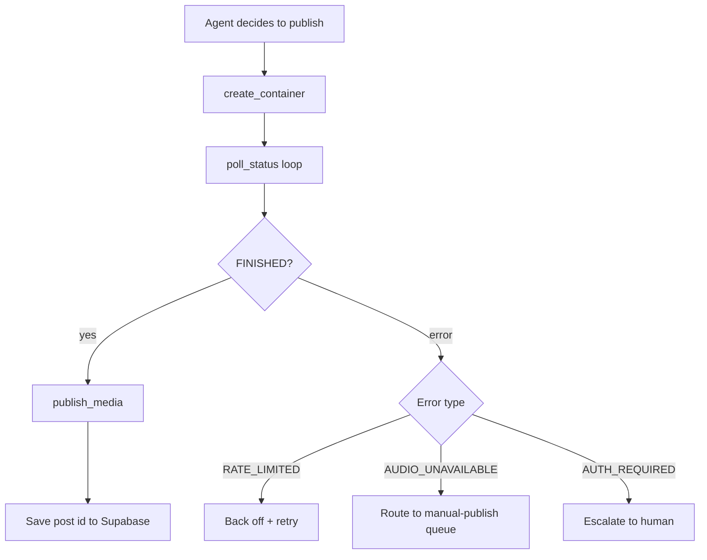
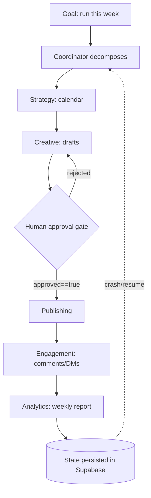
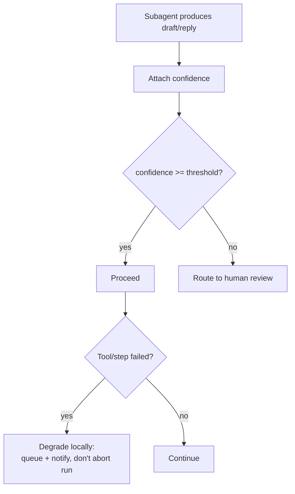
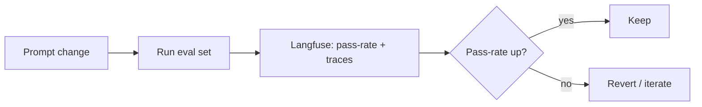
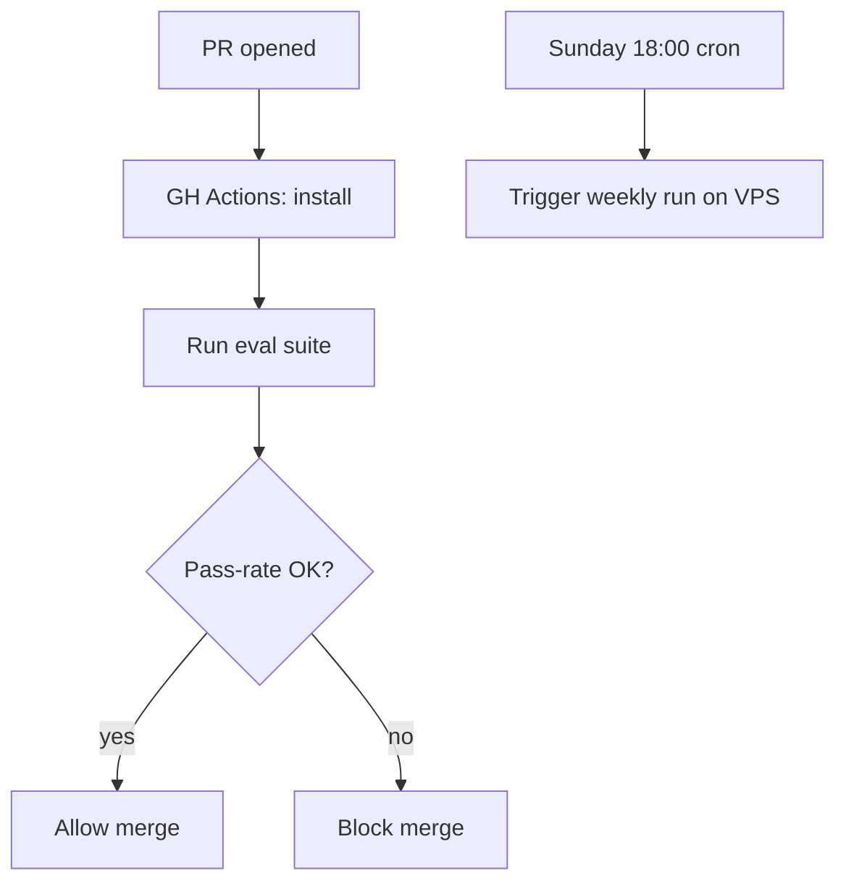
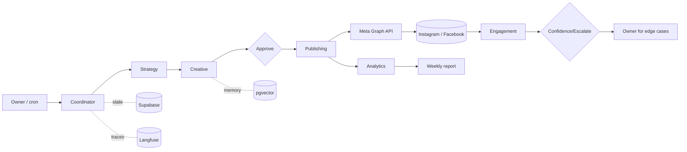
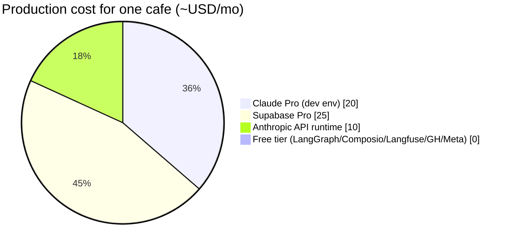

# Cafe Marketing Agent — Build & Study Schedule

A phase-by-phase execution guide that builds a production marketing agent **and** prepares you for the Claude Certified Architect – Foundations (CCA-F) exam. Every phase lists its tools, exact setup commands, a workflow diagram, validation checks, pitfalls, git hygiene, concept explanations with links, and an infographic where it helps.

> **Rendering note:** the ```mermaid``` blocks below render natively in GitHub and in most Markdown viewers. Keep this file at the repo root so it renders on the repo landing page next to the code.

**Targets:** ~140 hrs total, 4 weeks at ~35 hrs/week. ~$50–60/mo to run for one cafe.

---

## Exam coverage (infographic)



---

## Phase −1 — Private git repo foundation (do this once, ~1 hr)

Requirement #6 ("everything in a private git repo") is satisfied here and reinforced in every phase's **Git** subsection. Set the repo up first so every later artifact is committed as you go.

### Tools

| Tool | Signup / URL | Pricing | Purpose |
|---|---|---|---|
| Git | https://git-scm.com | Free | Version control |
| GitHub (private repo) | https://github.com | Free (unlimited private repos) | Remote host, CI/CD home |
| GitHub CLI (`gh`) | https://cli.github.com | Free | Create/manage repo from terminal |
| Infisical (secrets) | https://infisical.com | Free tier; Pro from ~$18/mo | Inject API keys without committing them |

### Setup commands

```bash
# Install GitHub CLI (macOS)
brew install gh && gh auth login

# Scaffold and create the PRIVATE repo
mkdir cafe-marketing-agent && cd cafe-marketing-agent
git init
gh repo create cafe-marketing-agent --private --source=. --remote=origin

# Lock secrets out of version control BEFORE the first commit
cat > .gitignore <<'EOF'
.env
.env.*
!.env.example
__pycache__/
*.pyc
.venv/
.langfuse/
node_modules/
.claude/settings.local.json
EOF

cat > .env.example <<'EOF'
ANTHROPIC_API_KEY=
META_APP_ID=
META_APP_SECRET=
META_PAGE_ACCESS_TOKEN=
IG_BUSINESS_ACCOUNT_ID=
SUPABASE_URL=
SUPABASE_KEY=
COMPOSIO_API_KEY=
LANGFUSE_PUBLIC_KEY=
LANGFUSE_SECRET_KEY=
EOF

git add .gitignore .env.example
git commit -m "chore: repo skeleton + secret hygiene"
git push -u origin main
```

### Target repo structure

```
cafe-marketing-agent/
├── README.md
├── schedule.md                    # this file
├── CLAUDE.md                      # project memory (Phase 0)
├── .claude/{commands/,settings.json}
├── .env.example                   # committed; .env is NOT
├── src/
│   ├── graph.py  state.py
│   ├── agents/{coordinator,strategy,creative,publishing,analytics}.py
│   ├── agents/engagement/{CLAUDE.md, engagement.py}
│   ├── tools/meta_graph.py
│   └── memory/
├── evals/  tests/
└── .github/workflows/ci.yml
```

### Validation
- [ ] `git remote -v` shows the private origin.
- [ ] Repo visibility is **Private** on github.com.
- [ ] `git status` never lists `.env` (only `.env.example`).

### Learnings / pitfalls
- **Never commit tokens.** A leaked `META_PAGE_ACCESS_TOKEN` lets anyone post as the cafe. `.gitignore` before first commit, and use Infisical (`infisical run -- python ...`) or `.env` locally.
- A committed secret stays in git history even after deletion — you'd have to rewrite history. Prevent, don't cure.

### Concepts & links
- Git secret hygiene: https://docs.github.com/en/code-security/secret-scanning/about-secret-scanning
- Infisical quickstart: https://infisical.com/docs/documentation/getting-started/introduction

---

## Global prerequisites — Meta account setup (~½ day)

Do before Phase 2; nothing publishes without it.

1. Convert the cafe's Instagram to a **Professional (Business)** account and link it to a **Facebook Page**.
2. Create a Meta app at https://developers.facebook.com → keep it in **Development mode**.
3. Add yourself (and your app) a role on the cafe's business assets so you can call the API **without full App Review** (valid for a single owned account; App Review + Business Verification only needed when you productize for clients you don't control).

Concept — why this matters: https://developers.facebook.com/docs/instagram-platform/content-publishing

---

## Phase 0 — Build environment in Claude Code · Domain 3 (20%) · ~10 hrs

### Tools

| Tool | Signup / URL | Pricing | Purpose |
|---|---|---|---|
| Claude Code | https://docs.claude.com/en/docs/claude-code/overview | Requires **Claude Pro $20/mo** ($17 annual); Max $100/$200 only if Opus-heavy all day | Your dev harness — and your live Domain 3 practice |
| Node.js | https://nodejs.org | Free | Runtime for the Claude Code CLI |

### Setup commands

```bash
# Install Node 18+ (verify current minimum in docs) then Claude Code
npm install -g @anthropic-ai/claude-code
claude --version

# First run authenticates against your Claude Pro plan
cd cafe-marketing-agent
claude
# inside the session:
/init        # generates a starter CLAUDE.md
/memory      # refine it
```

Create the memory hierarchy and a command:

```bash
# Project memory (committed, team-shared)
cat > CLAUDE.md <<'EOF'
# Cafe Marketing Agent — Project Memory
## Architecture
LangGraph coordinator + subagents. Publishing/engagement via Meta Graph API tools.
## Brand
@import docs/brand-voice.md
## NEVER DO (compliance)
- Never cold-DM. DM automation only inside the 24h user-initiated window.
- Never auto-publish a trending-audio Reel (route to manual queue).
- Never post without approved == true.
EOF

# Path-scoped memory: loads ONLY when Claude touches the engagement subtree
mkdir -p src/agents/engagement
cat > src/agents/engagement/CLAUDE.md <<'EOF'
# Engagement rules (path-scoped)
- 24h promotional window after user initiates.
- Max 200 automated DMs/hour; 1 private reply per comment trigger.
- Escalate complaints + high-value bookings to human.
EOF

# Custom slash command
mkdir -p .claude/commands
cat > .claude/commands/draft-caption.md <<'EOF'
Draft an on-brand Instagram caption for: $ARGUMENTS
Apply brand voice from CLAUDE.md. Output JSON: {caption, hashtags, cta, confidence}.
EOF

git add CLAUDE.md src/agents/engagement/CLAUDE.md .claude/
git commit -m "feat(phase0): claude code memory hierarchy + draft-caption command"
```

### Workflow — how config loads



### Validation
- [ ] `/context` shows the project CLAUDE.md loaded; engagement rules absent until you open a file in that subtree.
- [ ] `/draft-caption cold coffee combo` returns JSON.
- [ ] `settings.json` has an `ask` permission on any publish/DM tool.

### Learnings / pitfalls
- **Precedence is top-down:** enterprise > project > user. A user-level preference will *not* override a project rule — exam-relevant.
- Nested CLAUDE.md is **lazy-loaded**; don't expect it in context at launch. This is the "glob scoping / context fork" behaviour.
- A command in `.claude/commands/git/commit.md` becomes `/commit` (flat namespace), not `/git:commit`.

### Concepts & links
- Memory hierarchy (official): https://docs.anthropic.com/en/docs/claude-code/memory
- Slash commands (official): https://code.claude.com/docs/en/commands
- Full customization walkthrough: https://alexop.dev/posts/claude-code-customization-guide-claudemd-skills-subagents/

---

## Phase 1 — Single-node caption generator · Domain 4 (20%) · ~14 hrs

### Tools

| Tool | Signup / URL | Pricing | Purpose |
|---|---|---|---|
| Python 3.11+ | https://python.org | Free | Runtime |
| LangGraph | https://langchain-ai.github.io/langgraph/ | Free (OSS) | Agent graph |
| Anthropic API | https://console.anthropic.com | Pay-per-token: Haiku $1/$5, Sonnet $3/$15, Opus $5/$25 per MTok | The model. ~$5–15/mo at one-cafe volume |

### Setup commands

```bash
python -m venv .venv && source .venv/bin/activate
pip install langgraph langchain-anthropic pydantic
echo "ANTHROPIC_API_KEY=sk-ant-..." >> .env   # local only; gitignored
```

Define the validated-output node (sketch):

```python
# src/agents/creative.py
from pydantic import BaseModel, field_validator

class Caption(BaseModel):
    caption: str; hashtags: list[str]; cta: str; confidence: float
    @field_validator("caption")
    def length(cls, v):
        if len(v) > 300: raise ValueError("too long")
        return v
# node: call model -> parse JSON into Caption -> on failure, re-prompt with the error (max 2 retries)
```

### Workflow — single node with retry



### Validation
- [ ] Malformed model output is auto-repaired, not surfaced.
- [ ] A banned phrase triggers a retry, not a publish.
- [ ] Use **Haiku/Sonnet** here — Opus on captions is wasted spend.

### Learnings / pitfalls
- **Don't default to Opus.** Captions are a Haiku/Sonnet job; reserve Opus for the Phase 3 coordinator. Wrong model choice is the #1 cost blow-up.
- Few-shot needs **negative** examples (off-brand) or the model won't learn the boundary.
- Cap retries — an infinite repair loop burns tokens.

### Concepts & links
- Structured output / JSON mode: https://docs.claude.com/en/docs/build-with-claude/structured-outputs
- Prompt engineering overview: https://docs.claude.com/en/docs/build-with-claude/prompt-engineering/overview
- LangGraph quickstart: https://langchain-ai.github.io/langgraph/tutorials/introduction/

---

## Phase 2 — Meta Graph API as tools · Domain 2 (18%) · ~24 hrs

### Tools

| Tool | Signup / URL | Pricing | Purpose |
|---|---|---|---|
| Meta Graph API | https://developers.facebook.com/docs/instagram-platform/content-publishing | Free (ad spend only if running ads) | Publish, comment, insights |
| Composio | https://composio.dev | Free (20K tool calls/mo); $29/mo (200K) | Optional MCP/integration layer — **verify it has the IG actions you need; else call Graph API directly** |
| Supabase | https://supabase.com | Free tier *pauses after 1wk idle*; **Pro $25/mo** for production | Media hosting (public URL) + state |

### Setup commands

```bash
pip install requests composio-core langfuse
# Composio (optional layer)
composio login
composio apps           # check available integrations before committing to it
```

Meta publish is a **container flow** (create → poll → publish):

```python
# src/tools/meta_graph.py (sketch)
def create_container(image_url, caption): ...   # POST /{ig-id}/media
def poll_status(container_id): ...              # GET status_code until FINISHED
def publish(container_id): ...                  # POST /{ig-id}/media_publish
# Each returns a STRUCTURED result or typed error:
# {ok: false, error: "DM_WINDOW_EXPIRED", recovery: "defer"}
```

### Workflow — tool call with structured errors



### Validation
- [ ] Each tool does exactly one job and returns typed success/error.
- [ ] A simulated `RATE_LIMITED` triggers backoff, not a crash.
- [ ] Media is reachable at a **public URL** before publish (Meta requirement).
- [ ] Engagement tools are **not** importable by the analytics agent (least privilege).

### Learnings / pitfalls
- **Trending-audio Reels cannot be auto-published** — the API can't attach library music. Detect and route to manual queue, don't fail the run.
- Composio may not expose first-class IG publishing — **don't assume**; if not, the direct Graph API path is canonical and you keep more margin anyway.
- Tokens expire; build refresh handling early or you'll debug "works-then-breaks" later.

### Concepts & links
- Content publishing (official): https://developers.facebook.com/docs/instagram-platform/content-publishing
- MCP explained (official): https://modelcontextprotocol.io/introduction
- Tool design best practices: https://docs.claude.com/en/docs/agents-and-tools/tool-use/overview

---

## Phase 3 — Coordinator + subagents · Domain 1 (27%) · ~36 hrs

### Tools

| Tool | Signup / URL | Pricing | Purpose |
|---|---|---|---|
| LangGraph | (installed) | Free | Coordinator/subagent graph + state |
| Supabase | (Pro $25/mo) | — | Persist run state for crash-resume |
| Anthropic API | (in use) | — | Opus for the coordinator; Sonnet for subagents |

### Setup commands

```bash
pip install langgraph-checkpoint-postgres   # durable state in Supabase Postgres
```

### Workflow — orchestration with enforced approval gate



### Validation
- [ ] One command runs Strategy→Analytics end-to-end.
- [ ] `publish` is **unreachable** unless `approved == true` (enforced transition, not a polite check).
- [ ] Kill the process mid-run; on restart it resumes from the last checkpoint.

### Learnings / pitfalls
- **Not everything is an "agent."** Strategy/Creative/Publishing/Analytics are deterministic nodes; only **Engagement** needs true autonomy. Over-agentifying adds cost + nondeterminism — a likely exam distinction.
- Without durable checkpointing, a crash loses the whole run; wire Postgres checkpointer from the start.

### Concepts & links
- Multi-agent / orchestration: https://langchain-ai.github.io/langgraph/concepts/multi_agent/
- Building effective agents (Anthropic): https://www.anthropic.com/engineering/building-effective-agents
- Persistence/checkpoints: https://langchain-ai.github.io/langgraph/concepts/persistence/

---

## Phase 4 — Context & reliability · Domain 5 (15%) · ~20 hrs

### Tools

| Tool | Signup / URL | Pricing | Purpose |
|---|---|---|---|
| Supabase pgvector | https://supabase.com/docs/guides/ai | Included free in every Supabase tier | Brand memory / past-post embeddings |
| Zep (optional) | https://www.getzep.com | Free 10K msgs; Pro **$99/mo**; or self-host Graphiti (OSS) free | Temporal memory — **skip to start; use pgvector** |

### Setup commands

```sql
-- in Supabase SQL editor
create extension if not exists vector;
create table brand_memory (id bigserial primary key, content text, embedding vector(1536));
```

### Workflow — confidence-gated reliability



### Validation
- [ ] Brand voice stays consistent across a simulated month (memory retrieved each run).
- [ ] Low-confidence replies route to you, not to the customer.
- [ ] A single failed step degrades locally; the weekly run still completes.

### Learnings / pitfalls
- **Don't pay $99/mo for Zep yet** — you already pay for pgvector. Add Zep only if temporal "what was true when" reasoning becomes necessary.
- Confidence must gate *action*, not just get logged, or it's decorative.

### Concepts & links
- pgvector on Supabase: https://supabase.com/docs/guides/ai/vector-columns
- Context engineering: https://www.anthropic.com/engineering/effective-context-engineering-for-ai-agents
- Zep vs alternatives (background): https://www.getzep.com

---

## Phase 5 — Prompt & output hardening · Domain 4 (20%) · ~14 hrs

### Tools

| Tool | Signup / URL | Pricing | Purpose |
|---|---|---|---|
| Langfuse | https://langfuse.com | Free Hobby (50K units/mo); Core $29/mo; self-host (MIT) free | Tracing + eval pass-rate tracking |

### Setup commands

```bash
pip install langfuse
echo "LANGFUSE_PUBLIC_KEY=pk-..." >> .env
echo "LANGFUSE_SECRET_KEY=sk-..." >> .env
# wrap model calls with @observe() and run evals/run_evals.py
```

### Workflow — eval loop



### Validation
- [ ] A prompt edit shows a measurable pass-rate delta in Langfuse.
- [ ] Full 30-day calendar validates against one schema.

### Learnings / pitfalls
- Without an eval set you're "vibe-tuning" prompts — regressions slip in silently.
- Langfuse bills per *observation*; deep instrumentation multiplies units. Free tier is fine for one cafe, but know the metric.

### Concepts & links
- Langfuse evals: https://langfuse.com/docs/scores/overview
- Eval-driven prompt dev: https://docs.claude.com/en/docs/test-and-evaluate/eval-tool

---

## Phase 6 — CI/CD + automation · Domain 3 (20%) · ~12 hrs + ~10 hrs hardening

### Tools

| Tool | Signup / URL | Pricing | Purpose |
|---|---|---|---|
| GitHub Actions | https://github.com/features/actions | Free minutes cover this | Headless review + eval gate on PRs |
| Hetzner VPS | https://www.hetzner.com | ~€4–8/mo (you already run Hermes here) | Cron trigger for the weekly run |

### Setup commands

```yaml
# .github/workflows/ci.yml (sketch)
name: ci
on: [pull_request]
jobs:
  evals:
    runs-on: ubuntu-latest
    steps:
      - uses: actions/checkout@v4
      - run: pip install -r requirements.txt
      - run: python evals/run_evals.py   # fail the PR if pass-rate drops
```

```bash
# Weekly trigger on the VPS
(crontab -l; echo "0 18 * * 0 cd /opt/cafe-agent && .venv/bin/python -m src.graph") | crontab -
```

### Workflow — CI gate + schedule



### Validation
- [ ] A prompt change that lowers pass-rate fails the PR check.
- [ ] Secrets come from GitHub Actions secrets / Infisical, never the repo.
- [ ] Cron fires the weekly run and logs to Langfuse.

### Learnings / pitfalls
- Put API keys in **GitHub repository secrets**, not workflow YAML.
- A cron with no alerting fails silently — add a failure notification (Telegram, like your Hermes setup).

### Concepts & links
- Claude Code in CI/headless: https://docs.claude.com/en/docs/claude-code/overview
- GH Actions secrets: https://docs.github.com/en/actions/security-guides/using-secrets-in-github-actions

---

## Appendix A — Master request chain (high-level)



## Appendix B — Monthly cost (infographic)



| Tool | Free tier covers one cafe? | Paid if/when needed |
|---|---|---|
| Claude Code | No (needs Pro) | $20/mo |
| Anthropic API | No (pay-per-token) | ~$5–15/mo |
| Supabase | No (free pauses) | $25/mo |
| Composio | Yes (20K calls) | $29/mo |
| Langfuse | Yes (50K units) | $29/mo |
| Zep | Optional / skip | $99/mo |
| Browserbase | Optional (research) | $20/mo |
| LangGraph / Meta API / GitHub Actions | Yes | $0 |

**Floor: ~$50–60/mo.**

## Appendix C — Pre-exam reverse index

| Exam concept | Built in |
|---|---|
| Agentic loops, coordinator-subagent, task decomposition, session state, workflow enforcement | Phase 3 |
| Tool boundaries, structured errors, MCP, tool distribution | Phase 2 |
| CLAUDE.md hierarchy, slash commands, path-specific rules, plan mode, CI/CD | Phase 0 + 6 |
| Explicit criteria, few-shot, JSON-schema output, validation/retry | Phase 1 + 5 |
| Long-interaction memory, escalation, error propagation, confidence calibration | Phase 4 |

Verify Domain 3 details against the official docs map before the exam: https://docs.anthropic.com/en/docs/claude-code/claude_code_docs_map.md

